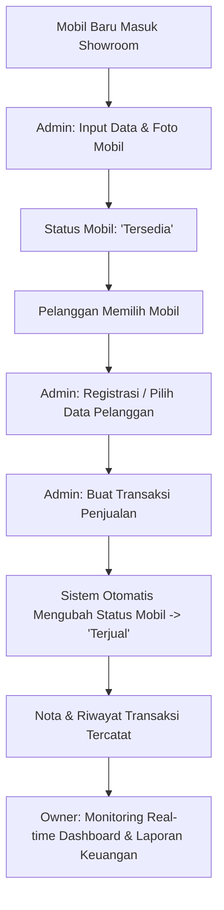

# 🚘 ATRIPO CARZONE — Sistem Informasi Penjualan & Persediaan Showroom Mobil Bekas

---

## 📌 1. Profil Aplikasi (Application Profile)

**Sistem Informasi Penjualan & Persediaan Showroom Mobil Bekas (Atripo Carzone)** adalah platform aplikasi berbasis web internal yang dirancang khusus untuk mengelola operasional showroom mobil bekas **Atripo Carzone** yang berlokasi di Cileunyi, Kabupaten Bandung, Jawa Barat.

Aplikasi ini dibuat untuk mempermudah pencatatan stok persediaan armada kendaraan, pendataan pelanggan, pemrosesan transaksi penjualan mobil secara efisien, serta menyajikan dashboard analitik laporan keuangan dan monitoring real-time bagi pemilik showroom.

### 🛠️ Teknologi yang Digunakan (Tech Stack):
- **Framework Utama**: Laravel 11 (PHP 8.3+)
- **Frontend / Interface**: Blade Templating Engine, Vanilla CSS Custom dengan efek *Glassmorphism* & Animasi Dynamic, Bootstrap 5, serta Bootstrap Icons
- **Database**: SQLite / MySQL (Eloquent ORM)
- **Penyimpanan Media**: Direct Public Uploads (`public/uploads`) tanpa ketergantungan symbolic link
- **Pengujian**: PHPUnit Testing Framework

---

## 🔄 2. Alur Kerja Sistem (System Workflow)

Sistem bekerja secara terintegrasi antar komponen dari tahap penerimaan unit hingga pelaporan transaksi:



### Langkah-langkah Detail Workflow:
1. **Penerimaan & Registrasi Armada (Inventory Registration)**
   - Admin memasukkan unit kendaraan baru ke dalam sistem (Merek, Tipe, Tahun, Warna, Transmisi, Plat Nomor, Harga, dan Foto Mobil).
   - Status awal kendaraan secara otomatis diset menjadi **`tersedia`**.
2. **Pengelolaan Data Pelanggan (Customer Management)**
   - Admin mencatat data pembeli/pelanggan (Nama, No. KTP, No. Telepon, Alamat).
3. **Pemrosesan Penjualan (Sales Transaction Processing)**
   - Admin memproses transaksi penjualan dengan memilih unit mobil yang berstatus `tersedia` dan pelanggan yang terdaftar.
   - Admin menentukan harga kesepakatan penjualan, tanggal transaksi, metode pembayaran (Transfer / Tunai), dan catatan pendukung.
   - **Otomatisasi Sistem**: Setelah transaksi disimpan, sistem secara otomatis mengubah status mobil yang bersangkutan dari `tersedia` menjadi **`terjual`**. Mobil yang sudah terjual tidak dapat dipilih kembali untuk transaksi baru.
4. **Monitoring & Pelaporan Eksekutif (Executive Monitoring)**
   - Owner/Pemilik mengakses dashboard monitoring khusus untuk melihat ringkasan omset penjualan, statistik total armada, jumlah unit tersedia/dipesan/terjual, serta riwayat transaksi secara real-time.

---

## 👥 3. Fungsi & Hak Akses Setiap Role (User Roles & Permissions)

Aplikasi memiliki **2 Role Utama** dengan tingkat hak akses dan fungsi yang terpisah sesuai dengan tanggung jawab operasional masing-masing:

### 1. 🛠️ Role Admin (Admin Operasional)
**Fungsi Utama**: Bertanggung jawab penuh terhadap manajemen harian toko/showroom, dari pencatatan armada mobil hingga eksekusi transaksi penjualan.

- **Kredensial Login Default**:
  - **Username**: `admin`
  - **Password**: `4dm1n`
- **Fungsi & Hak Akses**:
  - **Dashboard Operasional**: Melihat ringkasan cepat unit tersedia, dipesan, terjual, dan transaksi terbaru.
  - **Manajemen Armada Mobil (CRUD)**:
    - Menambah unit mobil baru beserta unggahan foto kendaraan (`public/uploads/cars`).
    - Mengubah detail informasi & memperbarui foto mobil.
    - Menghapus data mobil (selama mobil belum memiliki riwayat transaksi penjualan).
  - **Manajemen Pelanggan (CRUD)**:
    - Menambah, mengubah, dan melihat data pelanggan showroom.
  - **Transaksi Penjualan**:
    - Memproses dan menerbitkan transaksi penjualan mobil.
    - Mengubah status persediaan kendaraan secara otomatis menjadi `terjual`.
  - **Katalog Persediaan (Inventory)**: Melihat dan memantau status seluruh unit armada.

---

### 2. 📊 Role Owner (Pemilik Showroom)
**Fungsi Utama**: Berfokus pada pengawasan kinerja bisnis (*executive monitoring*), analisis omset penjualan, dan pengawasan stok tanpa melakukan perubahan data operasional harian (*read-only monitoring*).

- **Kredensial Login Default**:
  - **Username**: `owner`
  - **Password**: `own3r`
- **Fungsi & Hak Akses**:
  - **Dashboard Monitoring Pemilik**:
    - Melihat total omset/pendapatan akumulasi penjualan secara real-time.
    - Monitoring jumlah total armada kendaraan, unit tersedia, dipesan, dan terjual.
    - Melihat grafik dan ringkasan performa operasional showroom.
  - **Monitoring Persediaan (Read-Only)**:
    - Memantau katalog persediaan kendaraan beserta statusnya.
  - **Proteksi Akses (Middleware/Authorization)**:
    - Owner dibatasi oleh sistem untuk tidak dapat menambah, mengubah, atau menghapus data armada/transaksi secara langsung guna menjaga integritas data operasional harian.

---

## 🚀 4. Cara Menjalankan Aplikasi (Getting Started)

### Prasyarat (Prerequisites)
- PHP >= 8.3
- Composer
- Node.js & NPM (Opsional)

### Langkah Instalasi:
```bash
# 1. Clone repository / masuk ke folder project
cd sorummobil

# 2. Install dependensi composer
composer install

# 3. Jalankan migration dan seeder database
php artisan migrate:fresh --seed

# 4. Bersihkan cache konfigurasi & view
php artisan config:clear
php artisan view:clear

# 5. Jalankan server lokal
php artisan serve
```
Aplikasi dapat diakses melalui browser di **`http://127.0.0.1:8000`**.

---

## 🧪 5. Pengujian Otomatis (Testing)
Aplikasi ini dilengkapi dengan pengujian unit & fitur menggunakan PHPUnit:
```bash
./vendor/bin/phpunit
```
