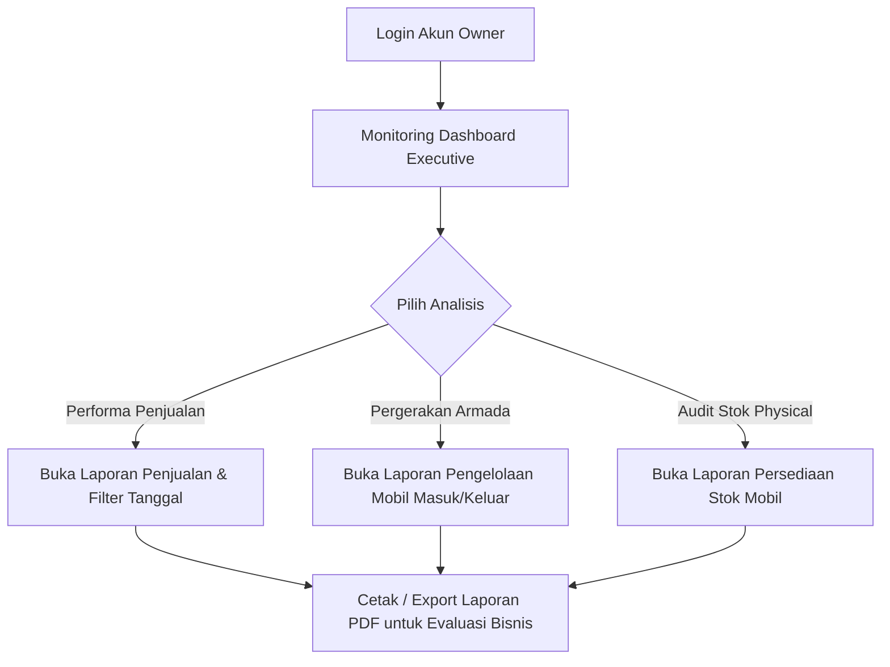
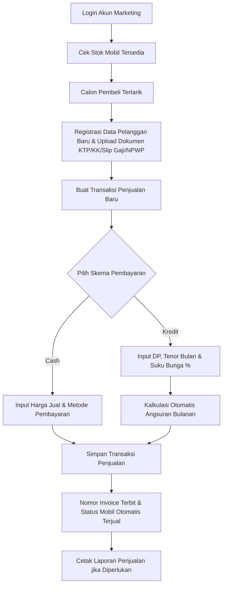
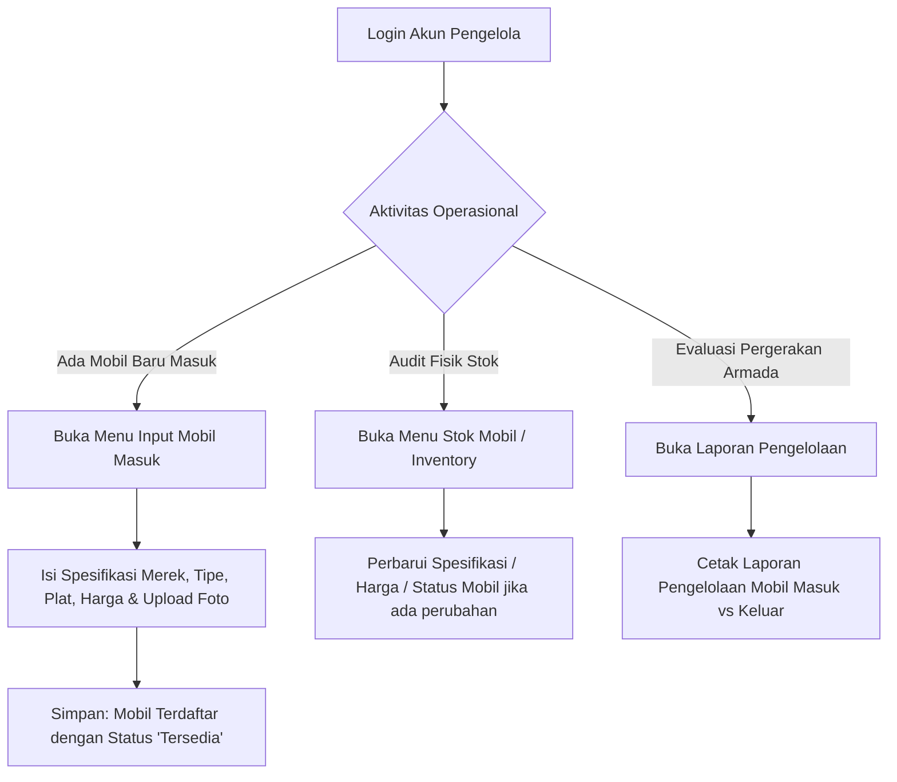
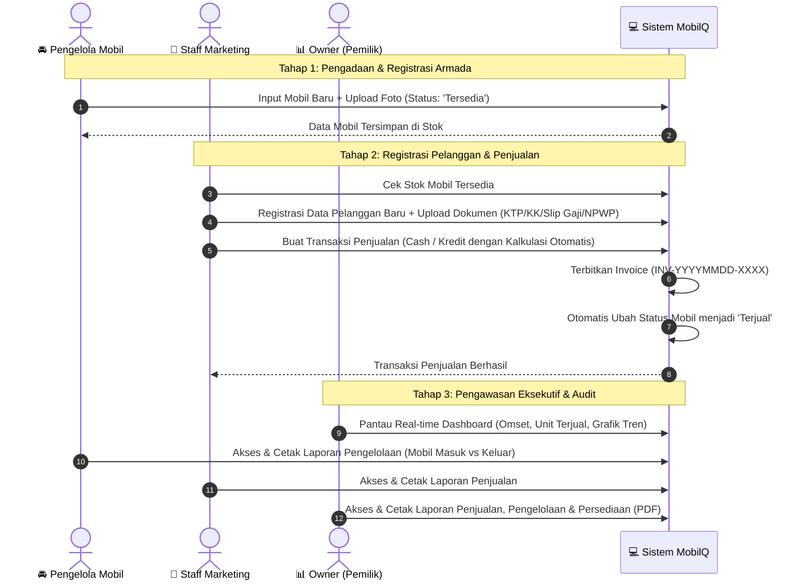

# 📋 DOKUMENTASI ROLE, FITUR, DAN WORKFLOW (ROLE NON-ADMIN)
## 🚘 Sistem Informasi Showroom Mobil Bekas — MobilQ

---

## 📌 1. Pendahuluan

Dokumen ini berisi panduan komprehensif mengenai **fungsi, hak akses, fitur utama, serta alur kerja (workflow)** untuk seluruh role pengguna dalam sistem informasi **MobilQ**, **khusus untuk Role Non-Admin**.

Sistem informasi MobilQ dirancang dengan penerapan *Role-Based Access Control* (RBAC) dan *Segregation of Duties* (pemisahan tugas) untuk memastikan setiap unit kerja operasional dapat menjalankan fungsinya secara fokus, aman, dan efisien.

Terdapat **3 Role Non-Admin** yang didokumentasikan dalam file ini:
1. 📊 **Owner (Pemilik Showroom)** — *Executive Monitoring & Financial Oversight*
2. 🤝 **Marketing (Staff Marketing)** — *Customer Relations & Sales Transaction Execution*
3. 🚘 **Pengelola (Pengelola Armada Mobil)** — *Fleet Procurement & Stock Management*

---

## 📊 2. Matriks Hak Akses Modul (Access Control Matrix)

Berikut adalah tabel perbandingan hak akses untuk ketiga role non-admin pada setiap modul aplikasi:

| Modul / Fitur Sistem | 📊 Owner (Pemilik) | 🤝 Marketing | 🚘 Pengelola Mobil |
| :--- | :---: | :---: | :---: |
| **Dashboard Executive Analytics** | ✅ (Tampilan Owner) | ✅ (Tampilan Standar) | ✅ (Tampilan Standar) |
| **Data Mobil (Katalog & Detail)** | 👁️ Lihat Sahaja | 👁️ Lihat Sahaja | 🟢 Full CRUD (Tambah/Edit/Hapus) |
| **Input Mobil Masuk (Restock)** | ❌ Tidak Berizin | ❌ Tidak Berizin | 🟢 Berizin (Input Baru & Upload Foto) |
| **Data Pelanggan (Customer)** | 👁️ Lihat Sahaja | 🟢 Full CRUD + Document Upload | 👁️ Lihat Sahaja |
| **Transaksi Penjualan Baru** | ❌ Tidak Berizin | 🟢 Berizin (Cash & Kredit) | ❌ Tidak Berizin |
| **Riwayat Penjualan & Invoice** | 👁️ Lihat Sahaja | 👁️ Lihat Sahaja | 👁️ Lihat Sahaja |
| **Stok Persediaan (Inventory)** | 👁️ Lihat Sahaja | 👁️ Lihat Sahaja | 👁️ Lihat Sahaja |
| **Laporan Penjualan (Sales Report)** | 🟢 Lihat & Cetak PDF | 🟢 Lihat & Cetak PDF | ❌ Tidak Berizin |
| **Laporan Pengelolaan (Fleet Report)**| 🟢 Lihat & Cetak PDF | ❌ Tidak Berizin | 🟢 Lihat & Cetak PDF |
| **Laporan Persediaan (Stock Report)**| 🟢 Lihat & Cetak PDF | ❌ Tidak Berizin | 🟢 Lihat & Cetak PDF |
| **Manajemen Profil Akun** | 🟢 Berizin (Update Self) | 🟢 Berizin (Update Self) | 🟢 Berizin (Update Self) |

*Keterangan*:
- 🟢 **Berizin**: Akses penuh / eksekusi fitur.
- 👁️ **Lihat Sahaja**: Akses *Read-Only* (tidak dapat menambah, mengubah, atau menghapus data).
- ❌ **Tidak Berizin**: Akses dibatasi oleh middleware sistem (`403 Forbidden`).

---

## 📊 3. Role Owner (Pemilik Showroom)

### 3.1 Deskripsi & Tanggung Jawab
Role **Owner** diperuntukkan bagi pemilik atau manajemen eksekutif showroom. Role ini berfokus pada pengawasan kinerja bisnis secara menyeluruh (*executive monitoring*), analisis keuangan/omset penjualan, serta pemantauan pergerakan persediaan armada secara real-time tanpa melakukan perubahan data operasional harian.

### 3.2 Kredensial Login Default
- **Username**: `owner`
- **Password**: `own3r`

### 3.3 Fitur Utama Role Owner
1. **Executive Dashboard Analytics (`/dashboard`)**:
   - **Kartu Metrik Utama**: Total armada kendaraan, jumlah unit berstatus `tersedia`, `dipesan`, dan `terjual`, total pendapatan penjualan (revenue), serta total volume transaksi.
   - **Grafik Tren Penjualan**: Visualisasi pendapatan bulanan & tren total transaksi penjualan selama 6 bulan terakhir.
   - **Ringkasan Aktivitas Terbaru**: Tabel cepat 5 kendaraan yang baru diinput dan 5 transaksi penjualan terkini.
2. **Monitoring Data Mobil (`/cars`)**:
   - Memantau katalog armada mobil beserta filter merek, status kendaraan, dan opsi pencarian.
   - Melihat detail spesifikasi kendaraan, foto, nomor plat, harga beli, dan harga jual.
3. **Monitoring Data Pelanggan (`/customers`)**:
   - Melihat daftar pelanggan terdaftar, riwayat pembelian kendaraan, serta kelengkapan dokumen pendukung (KTP, KK, Slip Gaji, NPWP).
4. **Monitoring Riwayat Penjualan (`/sales`)**:
   - Memantau seluruh faktur transaksi penjualan (Cash maupun Kredit).
   - Melihat rincian skema kredit (DP, tenor, bunga tahunan, dan estimasi angsuran bulanan).
5. **Monitoring Persediaan Stok (`/inventory`)**:
   - Melihat stok kendaraan fisik showroom dalam tampilan *Grid Card* atau *Table View*.
6. **Modul Laporan Eksekutif (Full Access & Print)**:
   - **Laporan Penjualan (`/reports/sales`)**: Rekap omset dan transaksi dalam rentang tanggal yang ditentukan.
   - **Laporan Pengelolaan (`/reports/management`)**: Rekap pergerakan armada (Mobil Masuk vs Mobil Keluar/Terjual).
   - **Laporan Persediaan (`/reports/inventory`)**: Rekap stok fisik kendaraan berdasarkan status (`tersedia`, `dipesan`, `terjual`) dan merek.
   - **Fungsi Export/Print**: Seluruh laporan dapat diprint atau diunduh sebagai format dokumen printable PDF.

### 3.4 Workflow Role Owner

#### Langkah-Langkah Alur Kerja:
1. **Login**: Owner masuk menggunakan kredensial `owner`.
2. **Review Dashboard**: Memeriksa indikator kinerja utama (KPI) pada Dashboard Owner (Omset total, unit terjual, dan grafik tren bulanan).
3. **Pemeriksaan Operasional**: Memeriksa transaksi penjualan terbaru pada halaman **Riwayat Penjualan** dan ketersediaan fisik kendaraan pada **Stok Mobil**.
4. **Evaluasi Periodik**:
   - Mengakses menu **Laporan Penjualan** untuk menganalisis pendapatan bulanan.
   - Mengakses menu **Laporan Pengelolaan** untuk mengevaluasi efisiensi pengadaan unit mobil masuk dibanding unit yang berhasil terjual.
   - Mengakses menu **Laporan Persediaan** untuk audit ketersediaan stok fisik kendaraan.
5. **Cetak Dokumen**: Menekan tombol **Cetak / PDF** pada halaman laporan untuk pengarsipan eksekutif.

### 3.5 Batasan & Keamanan Akses Owner
- Owner **dibatasi** oleh middleware `RoleMiddleware` sehingga **tidak dapat** menambah, mengedit, atau menghapus data mobil, pelanggan, maupun transaksi penjualan. Hal ini menjaga integritas data agar data keuangan dan audit tidak dapat dimanipulasi secara tidak sengaja.

---

## 🤝 4. Role Marketing (Staff Marketing / Penjualan)

### 4.1 Deskripsi & Tanggung Jawab
Role **Marketing** berfokus pada sisi komersial dan pelayanan pembeli. Staff Marketing bertanggung jawab untuk mengelola data pelanggan, mengumpulkan & mengunggah dokumen persyaratan kredit pelanggan, melakukan eksekusi transaksi penjualan mobil (Cash/Kredit), serta menerbitkan faktur penjualan.

### 4.2 Kredensial Login Default
- **Username**: `marketing`
- **Password**: `m4rk3t1ng`

### 4.3 Fitur Utama Role Marketing
1. **Manajemen Data Pelanggan (CRUD Pelanggan - `/customers`)**:
   - **Registrasi Pelanggan Baru**: Memasukkan data identitas lengkap (Nama, No. KTP, No. Telepon, Email, Alamat, No. KK, No. NPWP).
   - **Pengelolaan Berkas Dokumen Kredit**: Mengunggah file scan/foto dokumen fisik pelanggan meliputi:
     - Foto KTP (`ktp_file`)
     - Kartu Keluarga (`kk_file`)
     - Slip Gaji (`salary_slip_file`)
     - NPWP (`npwp_file`)
   - **Edit & Perbarui Pelanggan**: Memperbarui data kontak atau memperbarui berkas dokumen yang diunggah.
   - **Hapus Data Pelanggan**: Menghapus data pelanggan (hanya jika pelanggan belum memiliki riwayat transaksi).
2. **Pemrosesan Transaksi Penjualan Baru (`/sales-create`)**:
   - **Pilihan Unit Mobil**: Memilih armada kendaraan yang berstatus `tersedia` atau `dipesan`.
   - **Skema Cash (Tunai/Transfer)**: Input harga kesepakatan penjualan, metode pembayaran, dan catatan.
   - **Skema Kredit (Cicilan)**:
     - Input Uang Muka / DP (*Down Payment*).
     - Input Tenor Kredit (bulan, misal: 12, 24, 36, 48 bulan).
     - Input Suku Bunga per Tahun (% per tahun).
     - **Kalkulator Kredit Otomatis**: Sistem secara otomatis menghitung Pokok Utang, Total Bunga, dan Angsuran Bulanan (*Monthly Installment*).
   - **Otomatisasi Status Mobil**: Setelah transaksi berhasil disimpan:
     - Sistem menerbitkan Nomor Invoice unik otomatis (`INV-YYYYMMDD-XXXX`).
     - Status mobil yang bersangkutan **secara otomatis diubah menjadi `terjual`**.
     - Unit yang telah terjual dikunci sehingga tidak dapat dipilih untuk transaksi baru.
3. **Riwayat Penjualan (`/sales`)**:
   - Memantau daftar transaksi penjualan yang telah diproses.
   - Pencarian invoice, pelanggan, atau unit kendaraan, serta filter jenis pembayaran (Cash/Kredit) dan tanggal.
4. **Katalog & Stok Persediaan (`/cars` & `/inventory`)**:
   - Memantau katalog ketersediaan kendaraan untuk dipresentasikan kepada calon pembeli.
5. **Laporan Penjualan (`/reports/sales`)**:
   - Mengakses dan mencetak Laporan Penjualan untuk evaluasi pencapaian target penjualan bulanan.

### 4.4 Workflow Role Marketing

#### Langkah-Langkah Alur Kerja:
1. **Pengecekan Stok**: Marketing login dan memeriksa ketersediaan kendaraan pada menu **Stok Mobil**.
2. **Pendataan Pelanggan**: Ketika calon pembeli sepakat membeli, Marketing masuk ke menu **Data Pelanggan** -> **Tambah Pelanggan Baru**, mengisi identitas lengkap dan mengunggah dokumen persyaratan (terutama jika mengajukan kredit).
3. **Eksekusi Penjualan**:
   - Masuk ke menu **Penjualan Baru** (`/sales-create`).
   - Pilih unit mobil yang `tersedia` dan pilih data pelanggan yang telah didaftarkan.
   - Jika transaksi **Cash**: Isi harga kesepakatan dan tanggal penjualan.
   - Jika transaksi **Kredit**: Isi DP, Tenor (bulan), dan Suku Bunga. Sistem menghitung angsuran secara otomatis.
4. **Finalisasi Transaksi**: Klik tombol **Simpan Transaksi**. Sistem akan membuat faktur penjualan baru dan mengubah status mobil menjadi **`terjual`**.
5. **Monitoring**: Memantau status transaksi pada menu **Riwayat Penjualan**.

### 4.5 Batasan & Keamanan Akses Marketing
- Marketing **tidak berizin** untuk menambah, mengedit, atau menghapus data armada mobil di menu Master Mobil (tugas Pengelola Mobil).
- Marketing **tidak berizin** mengakses Laporan Pengelolaan dan Laporan Persediaan internal.

---

## 🚘 5. Role Pengelola (Pengelola Armada Mobil)

### 5.1 Deskripsi & Tanggung Jawab
Role **Pengelola Mobil** bertanggung jawab atas manajemen fisik armada kendaraan dan pengawasan stok persediaan showroom. Tugas utamanya meliputi pencatatan unit mobil baru yang masuk (*restock/procurement*), pembaruan data spesifikasi dan kondisi kendaraan, pengorganisasian stok, serta pemantauan laporan inventaris.

### 5.2 Kredensial Login Default
- **Username**: `pengelola`
- **Password**: `p3ng3lol4`

### 5.3 Fitur Utama Role Pengelola
1. **Manajemen Master Data Mobil (CRUD Mobil - `/cars`)**:
   - **Input Mobil Masuk (`/cars-create`)**: Menginput unit mobil bekas yang baru dibeli/masuk ke showroom. Data yang dicatat meliputi:
     - Merek (Brand), Tipe/Model, Tahun Pembuatan, Warna, Transmisi (Manual / Otomatis).
     - Plat Nomor Kendaraan, Harga Beli, Harga Jual, Status Awal (`tersedia`/`dipesan`), Deskripsi Kendaraan.
     - Upload Foto Kendaraan (`image`).
   - **Edit & Update Mobil (`/cars/{id}/edit`)**: Memperbarui harga jual, deskripsi, mengganti foto mobil, atau memperbarui status ketersediaan.
   - **Hapus Data Mobil (`/cars/{id}`)**: Menghapus data mobil dari sistem (dengan proteksi: mobil yang sudah memiliki riwayat penjualan **tidak dapat dihapus**).
2. **Manajemen Persediaan Stok Mobil (`/inventory`)**:
   - Memantau ketersediaan fisik seluruh kendaraan showroom.
   - Opsi tampilan *Grid Card* dengan foto kendaraan atau *Table View*.
   - Filter ketersediaan berdasarkan status (`tersedia`, `dipesan`, `terjual`) dan filter berdasarkan Merek.
3. **Laporan Pengelolaan Armada (`/reports/management`)**:
   - Memantau rekapitulasi **Mobil Masuk** (unit kendaraan baru yang didaftarkan pada periode tertentu) versus **Mobil Keluar** (unit kendaraan yang terjual).
   - Menghitung total akumulasi unit masuk, unit keluar, dan stok sisa tersedia secara presisi.
   - Mengunduh/Mencetak Laporan Pengelolaan Armada (PDF/Print).
4. **Laporan Persediaan (`/reports/inventory`)**:
   - Memantau dan mencetak rekap ketersediaan stok fisik kendaraan berdasarkan kategori status dan merek.
5. **Monitoring Data Pelanggan & Penjualan (Read-Only)**:
   - Melihat daftar pelanggan dan riwayat transaksi penjualan untuk referensi ketersediaan stok.

### 5.4 Workflow Role Pengelola

#### Langkah-Langkah Alur Kerja:
1. **Login**: Pengelola masuk menggunakan akun `pengelola`.
2. **Input Unit Masuk (Restock Armada)**:
   - Saat ada unit kendaraan baru tiba di showroom, klik menu **Input Mobil Masuk** (`/cars-create`).
   - Isi formulir spesifikasi lengkap (Merek, Tipe, Tahun, Plat Nomor, Warna, Transmisi, Harga Beli, Harga Jual, Deskripsi).
   - Unggah foto fisik kendaraan.
   - Simpan data. Mobil secara otomatis terdaftar dengan status **`tersedia`**.
3. **Pemeliharaan Data Stok**:
   - Jika ada perubahan harga jual atau perbaikan spesifikasi, Pengelola melakukan **Edit Mobil** melalui menu **Data Mobil**.
   - Memantau distribusi status ketersediaan pada halaman **Stok Mobil**.
4. **Pelaporan Inventaris**:
   - Mengakses **Laporan Pengelolaan** untuk mencetak rekap mutasi kendaraan (Mobil Masuk vs Mobil Keluar).
   - Mengakses **Laporan Persediaan** untuk mencetak dokumen persediaan stok akhir.

### 5.5 Batasan & Keamanan Akses Pengelola
- Pengelola **tidak berizin** untuk menambah, mengedit, atau menghapus Data Pelanggan.
- Pengelola **tidak berizin** untuk membuat transaksi penjualan baru (`/sales-create` dibatasi khusus Marketing & Admin).
- Pengelola **tidak berizin** mengakses Laporan Penjualan (laporan finansial penjualan dikunci khusus Owner, Marketing, dan Admin).

---

## 🔄 6. Alur Kerja Terintegrasi Antar-Role (Cross-Role Operational Workflow)

Berikut adalah diagram alur kerja yang menggambarkan bagaimana ketiga role non-admin saling berinteraksi dalam operasional harian showroom MobilQ:

---

## 🔒 7. Kebijakan Keamanan & Manajemen Akun

1. **Pemisahan Tugas (Segregation of Duties)**:
   - **Pengelola Mobil** mengurus ketersediaan fisik armada.
   - **Marketing** mengurus hubungan pembeli dan eksekusi transaksi.
   - **Owner** mengawasi kinerja tanpa mengubah data operasional.
   - Pemisahan ini mencegah kecurangan (*fraud*) dan menjaga akurasi catatan keuangan showroom.
2. **Rekomendasi Pembaruan Password**:
   - Setelah sistem berhasil diinstalasi, pengguna dari masing-masing role disarankan untuk segera memperbarui password bawaan melalui menu **Profil** (`/profile`).
3. **Penanganan Akses Ditolak (403 Forbidden)**:
   - Jika pengguna mencoba mengakses URL di luar wewenang rolenya, sistem akan secara otomatis memblokir akses dan menampilkan pesan peringatan:
     > *"Akses Ditolak. Anda tidak memiliki izin untuk mengakses halaman ini."*

---

*Dokumen ini dibuat otomatis sebagai panduan resmi operasional Sistem Informasi Showroom Mobil Bekas MobilQ.*
